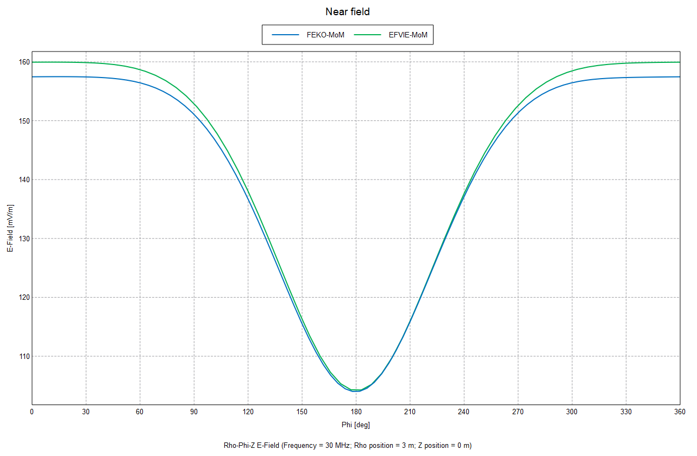

# EFVIE-MoM

Implemented a method of moment solver to the electric field volume integral equation for electromagnetic scattering, using SWG basis functions.

Unlike my SBR-PO implementation, this is a full wave solution and it makes no simplifying assumptions about the electromagnetic phenomena. As such, this is mathematically and computationally more intensive compared to it. This is also more computationally intensive than surface integral equation solvers, but it makes us able to analyze scattering from non-homogeneous objects.

Here is how computationally intensive this is: when you increase the frequency of the incident wave 2 times, the amount of tetrahedrons in the object model has to increase 2^3 times, and so the MoM matrix grows (2^3)^2 times, which we have to solve in order to get the results. It's very easy to get out of time and memory bounds as the object in analysis gets electrically large.

This is an experimental project and current working version is only in MATLAB.

Current working version resides in the folder "MATLAB\TEST\SW".

See my internship diary (in Turkish) for more information.

## Here are some results:

Scattering from a unit sphere:  
  
Tetrahedron Count = 1110  
Basis Function Count = 2349  
Frequency = 30 MHz  
Electrical Size = 0.2λ  
Relative Permittivity = 50  
Dielectric Loss Tangent = 0.3
Incident Plane Wave Direction = x-axis (phi = 0)
Incident Plane Wave Magnitude = 1
Incident Plane Wave Polarization = (0,1,1) / sqrt(2)

